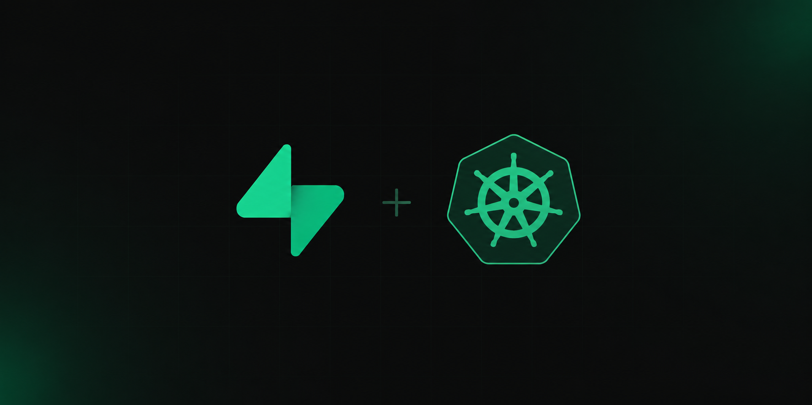

<p align="center">
  <a href="https://github.com/supabase-community/supabase-kubernetes">
    
  </a>
</p>

---

<p align="center">
  Kubernetes-native ways to run <a href="https://github.com/supabase/supabase">Supabase</a> on your own cluster.
</p>

<p align="center">
  <a href="#overview">Overview</a> |
  <a href="#quick-start">Quick Start</a> |
  <a href="./charts/supabase/README.md">Helm Chart</a> |
  <a href="https://supabase.io/docs">Supabase Docs</a> |
  <a href="#contributing">Contributing</a>
</p>

You can choose between two approaches:

- **Supabase Kubernetes Operator**: manage Supabase through Kubernetes Custom Resources (`core.supabase.io/v1alpha1`). The Operator is in an early stage of development and its API may change.
- **Supabase Helm Chart**: deploy Supabase using a traditional Helm chart. See [`charts/supabase`](./charts/supabase/README.md) for details.

## Overview

The Operator exposes the following Kubernetes Custom Resources:

| Resource | Short name | Description |
|---|---|---|
| `Project` | `projects` | Represents a complete Supabase instance. It is modular, allowing you to enable only the components you need |
| `SingleDatabase` | `singledatabases` | Postgres database managed by the Operator |
| `Function` | `functions` | Edge Functions deployed in the cluster |
| `Migration` | `migrations` | Applies SQL scripts to referenced databases. Also used internally by the Operator to manage Supabase upgrade migrations |

## Quick Start

Before you begin, make sure you have:

- A Kubernetes cluster (1.28+ recommended)
- `kubectl` configured to connect to your cluster
- `helm` 3.x+
- `make`
- Docker (or another container runtime supported by the Makefile `CONTAINER_TOOL` variable)
- A container registry accessible from your cluster, because you must build and push the Operator image before deploying it

Add the Supabase Helm repository:

```bash
helm repo add supabase https://supabase-community.github.io/supabase-kubernetes
helm repo update
```

### Deploy the Operator

The Operator is not published as a pre-built image, so you must build and push it yourself. Run:

```bash
make docker-build IMG=example.com/supabase-operator:v0.0.1
make docker-push IMG=example.com/supabase-operator:v0.0.1
```

Then deploy the Operator into the `supabase-operator` namespace:

```bash
helm install supabase-operator supabase/supabase-operator \
  --namespace supabase-operator \
  --create-namespace \
  --set manager.image.repository=example.com/supabase-operator \
  --set manager.image.tag=v0.0.1
```

This installs the CRDs and deploys the controller in a single step.

### Deploy a Supabase Project

The `supabase-project` chart creates a `SingleDatabase` and a `Project` that references it, with the components you need. Install it setting the required values:

```bash
helm install supabase supabase/supabase-project \
  --set fullnameOverride=supabase \
  --set project.http.hostname=localhost \
  --set project.http.port=8000 \
  --set auth.siteUrl=http://localhost:3000 \
  --set studio.orgName="Default Organization" \
  --set studio.projName="Default Project"
```

The Operator will provision the Postgres StatefulSet, the component Deployments, Services, Secrets, and run sync Jobs to configure JWT keys and the database.

Retrieve the generated database password, the Studio credentials, and the API keys with a single command:

```bash
kubectl get secrets supabase-postgres-auth supabase-envoy-auth supabase-jwt \
  -o go-template='{{range .items}}{{if eq .metadata.name "supabase-postgres-auth"}}{{printf "%-18s: %s" "Database Password" (.data.password | base64decode)}}{{"\n"}}{{end}}{{if eq .metadata.name "supabase-envoy-auth"}}{{printf "%-18s: %s" "Studio Username" (.data.username | base64decode)}}{{"\n"}}{{printf "%-18s: %s" "Studio Password" (.data.password | base64decode)}}{{"\n"}}{{end}}{{if eq .metadata.name "supabase-jwt"}}{{printf "%-18s: %s" "Publishable Key" (index .data "publishable-key" | base64decode)}}{{"\n"}}{{printf "%-18s: %s" "Secret Key" (index .data "secret-key" | base64decode)}}{{"\n"}}{{end}}{{end}}'
```

### Access Supabase

Once the Project is ready, forward the Envoy gateway to your local machine:

```bash
kubectl port-forward svc/supabase-envoy 8000:8000
```

The Studio and the Supabase APIs are available at:

```
http://localhost:8000
```

## Contributing

Contributions are welcome. Before starting significant work, please open an issue to discuss your idea or bug report. When you are ready, fork the repository, make your changes, and open a pull request.

For setup instructions, build commands, and testing workflows, see [DEVELOPERS.md](./DEVELOPERS.md).

## Support

This project is supported by the community and not officially supported by Supabase. Please do not create issues on the official Supabase repositories if you face problems using this project. Instead, open an issue on this repository.
